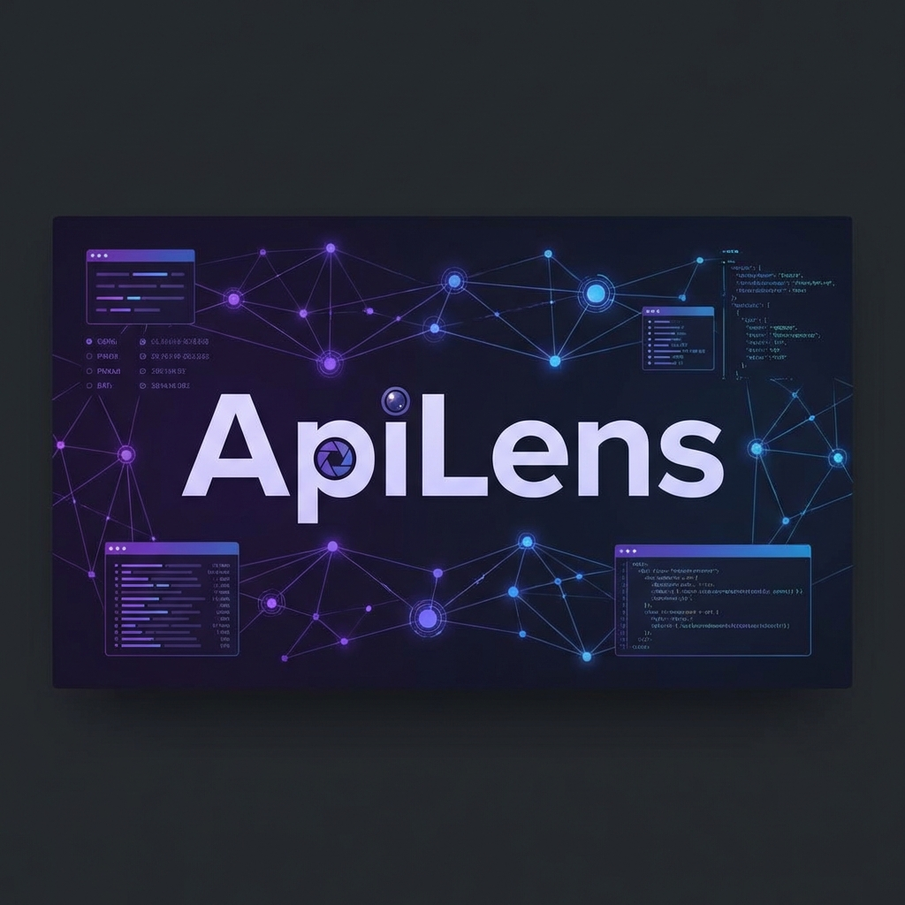

# ApiLens

A powerful, local-first API testing tool facilitating Request building, Response analysis, and Visual Branching Workflows. Built with Flutter, Riverpod, and Hive.



## 🌟 Key Features

### 1. Request Builder
- **Methods**: GET, POST, PUT, DELETE, PATCH, etc.
- **Headers/Params**: Key-Value editor with toggle support.
- **Body Types**: JSON, Text, None. supports JSON template variables.
- **Auth**: Bearer Token, Basic Auth, API Key.
- **cURL Integration**: Import/Export cURL commands directly.

### 2. Environment Manager
- Create environments (Dev, Prod) with variables.
- Use `{{baseUrl}}`, `{{token}}` in URL, Headers, Body.
- Auto-compilation of variables during execution.

### 3. Visual Workflow Orchestrator (New)
A graph-based execution engine to chain APIs and create complex logic.
- **Drag & Drop Interface**: Visually design API flows.
- **Node Types**:
    - **Start/End**: Define flow boundaries.
    - **HTTP Node**: Execute API requests. Routes to `success` (2xx) or `failure`.
    - **Condition Node**: Branch logic based on expressions (e.g. `{{node.api.response.status}} == 200`).
- **Data Passing**: Reference output from previous nodes using `{{node.{nodeId}.response.body.{field}}}`.
- **Debugging**: 
    - Real-time status highlights (Running, Success, Failure).
    - **Context Inspector**: View raw JSON results of every executed node.
- **Persistence**: Save/Load/Export/Import workflows locally via JSON.

---

## 🚀 Getting Started

### Prerequisites
- Flutter SDK (3.x+)
- macOS, Windows, or Linux (Currently optimized for Desktop)

### Installation
```bash
# Clone the repository
git clone https://github.com/clevekim00/ApiLens.git

# Install dependencies
flutter pub get

# Run on macOS (Recommended)
flutter run -d macos
```

---

## 📖 Workflow Template Syntax

The Workflow Engine supports a Handlebars-like syntax for dynamic data resolution.

### 1. Environment Variables
Access variables defined in the globally selected Environment.
- `{{env.baseUrl}}`
- `{{env.apiKey}}`

### 2. Node Data References
Access results from executed nodes by their **Node ID**.
- **Status Code**: `{{node.{nodeId}.response.statusCode}}`
- **Body Field**: `{{node.{nodeId}.response.body.accessToken}}` (supports nested JSON)
- **Headers**: `{{node.{nodeId}.response.headers.content-type}}`

### 3. Condition Expressions
Used in **Condition Node** to determine routing.
- `{{node.login.response.statusCode}} == 200`
- `{{node.user.response.body.age}} > 18`
- `{{node.response.body.message}} contains "success"`

---

## 📚 Documentation
- [AI Integration Guide](docs/ai_integration_guide.md)
- [Workflow Editor Plan](docs/workflow_editor_plan.md)
- [Workflow Implementation Plan](docs/workflow_implementation_plan.md)
- [Data Model Design](docs/workflow_data_model_design.md)

---

## 🗺️ Roadmap

- [x] Basic Request/Response
- [x] Environment Variables
- [x] Visual Workflow Editor
- [x] Workflow Persistence & Export
- [x] Debug Panel & Context Inspector
- [ ] WebSocket Support
- [ ] GraphQL Support
- [ ] Cloud Sync / Team Sharing
- [ ] CLI Runner for CI/CD

---

## License
MIT
