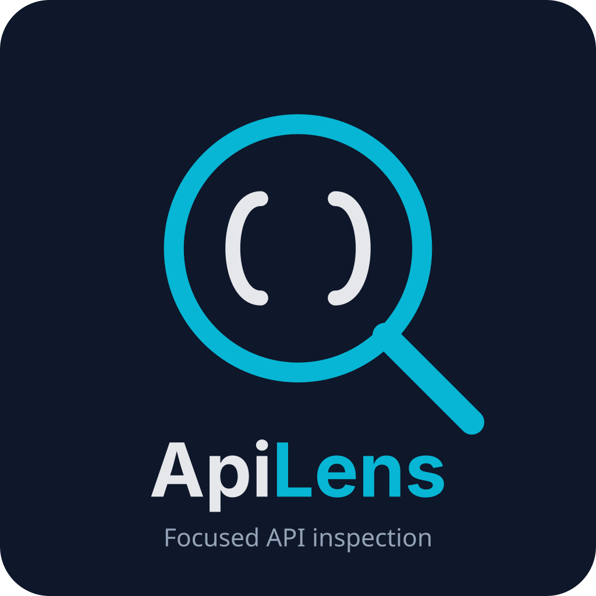

# ApiLens: The Unified Visual API Orchestration Platform

  
   
  <h3>Connect. Automate. Visualize.</h3>
  
A high-performance, premium developer tool for REST, WebSocket, and GraphQL orchestration.

---

## 🎯 Project Purpose

In modern software development, developers often juggle multiple disconnected tools: Postman for REST, custom scripts for automation, and specialized clients for WebSocket or GraphQL. **ApiLens** was created to unify these into a single, cohesive experience.

Our goal is to **bridge the gap between simple API testing and complex workflow automation**. By providing a visual, node-based editor with real-time feedback, ApiLens allows developers to:
- **Unify Protocols**: Manage REST, WebSocket, and GraphQL in one place.
- **Eliminate Boilerplate**: Replace fragile bash/python test scripts with robust visual logic.
- **Gain Visibility**: See exactly how data flows through your system with real-time visual debugging.
- **Accelerate Development**: Use a professional Command Palette and Templates to move faster than ever.

---

## ✨ Key Features

### 🚀 Advanced Orchestration
- **Visual Workflow Editor**: Design complex sequences (e.g., Auth -> Token -> WebSocket Connect) using a node-based interface.
- **Real-time Visual Debugging**: Watch your workflow execute live. Successful paths turn **Green**, failures turn **Red**, and active nodes pulse with a **Blue** glow.
- **Timeout/Retry Policies**: Apply per-attempt timeouts, retry backoff, and retryable status code rules to HTTP, GraphQL, and WebSocket workflow nodes.
- **Workflow Templates**: Access a library of pre-built scenarios like "Auth Flow", "CRUD Sync", and "GraphQL Explorer".

### 🧭 Load Hub Distributed Performance Testing
- **Remote Workflow Load Runs**: Split a single Workflow across multiple remote agents for LoadRunner-style performance tests.
- **Machine and Agent Operations**: Monitor remote machine state, agent heartbeat, capacity, version, and connection health.
- **Real-time Metrics Ingest**: Aggregate agent-side `MetricWindowEvent` data into RPS, error rate, and p50/p90/p95/p99 latency.
- **Agent Upgrade Orchestration**: Coordinate drain, install, restart, health check, and rollback flows for remote agents.
- **Reports and Export**: Export completed run results as JSON, CSV, or Markdown reports.

### 🛠 Professional Developer Tools
- **Multi-Protocol Support**: Full-featured clients for REST, WebSocket (with subprotocol support), and GraphQL (with variables and introspection).
- **Command Palette (Cmd+K)**: Search through thousands of requests and workflows instantly. Switch themes or settings without leaving the keyboard.
- **OpenAPI / Swagger Import**: Modern, filtered import system to bring in your entire API specification with one click.

### 💎 Premium Experience
- **Glassmorphism UI**: A stunning, modern interface built with Flutter, featuring smooth 60FPS animations and a curated dark mode.
- **Workgroup System**: Organize your work by project, not by list. Isolate environments and shared data.
- **Cross-Platform**: Run everywhere—macOS, Windows, Linux, and the Web.
- **Robust UI Testing**: Automated widget tests for core screens (Dashboard, Request, Import) ensure UI stability.

---

## 📖 How to Use

### 1. Organize with Workgroups
ApiLens uses **Workgroups** to keep your projects isolated.
- Click the **+** icon in the sidebar to create your first project.
- Use the **Import** feature to bring in an existing OpenAPI (Swagger) JSON/YAML file.

### 2. Build Your First Request
- Select a protocol (REST/WS/GQL) from the top tabs.
- Enter your URL and parameters. ApiLens supports **Template Variables** `{{ variable_name }}` that resolve dynamically.
- Click **Send** to see the formatted response, headers, and execution timing.

### 3. Design a Visual Workflow
- Navigate to the **Workflow Tab**.
- Drag nodes from the palette onto the canvas.
- Connect ports to define the logic flow (e.g., connect the `success` output of a Login node to the `input` of a Fetch node).
- Configure timeout/retry policies for unreliable network calls and connect `failure` ports for recovery paths.
- Click **Run** to execute and watch the visual debugging in action.

### 4. Monitor Load Tests with Load Hub
- Open the **Load Hub** tab from the main navigation.
- Use Machines to inspect remote machine and agent status.
- Use Runs and Metrics to monitor distributed execution, RPS, error rate, and latency percentiles.
- Use Agent Updates to follow staged upgrades and rollback status.

### 5. Master Efficiency with Command Palette
- Press **Cmd + K** (or **Ctrl + K**) at any time.
- Type to search for a specific request, workflow, or app command.
- Use arrow keys and **Enter** to navigate instantly.

---

## 🛠 Tech Stack
- **Framework**: [Flutter](https://flutter.dev) for high-performance, multi-platform UI.
- **State Management**: [Riverpod](https://riverpod.dev) for robust, reactive data flow.
- **Local Storage**: [Hive](https://pub.dev/packages/hive) and [Isar](https://isar.dev) for fast, encrypted local data.
- **Networking**: [Dio](https://pub.dev/packages/dio) with custom interceptors for advanced protocol handling.

---

## 🚀 Getting Started

### 📦 Downloads (v1.0.0)
- **macOS**: [Download ApiLens for macOS v1.0.0 (.zip)](release/ApiLens_macOS_v1.0.0.zip)
- **Other Platforms**: Build from source (see Installation Guide)

### 📖 Guides
- **Installation**: [Full Installation Guide](docs/INSTALLATION_GUIDE_EN.md)
- **Usage**: [Detailed Usage Guide](docs/USAGE_GUIDE_EN.md)
- **Load Hub Design**: [Remote Load Runner Design](docs/REMOTE_LOAD_RUNNER_DESIGN.ko.md)
- **Load Hub Operations**: [Load Hub Operations Guide](docs/LOAD_HUB_OPERATIONS.ko.md)
- **Development**: [Technical Guide for Developers](docs/DEVELOP_GUIDE_EN.md)

### 🛠 Local Development
1. Ensure you have [Flutter](https://flutter.dev) installed.
2. Clone the repository and run `flutter pub get`.
3. Launch with `flutter run`.

---

## 🌍 Resources
- **User Guide**: [Detailed Usage Guide](docs/USAGE_GUIDE_EN.md)
- **Load Hub Docs**: [Design](docs/REMOTE_LOAD_RUNNER_DESIGN.ko.md), [Operations](docs/LOAD_HUB_OPERATIONS.ko.md), [Remote Agent Setup](docs/REMOTE_AGENT_SETUP.ko.md)
- **Technical Docs**: Check the `docs/` directory for protocol-specific guides (GraphQL, WebSocket).

---
*Other languages: [한국어](README_KO.md) | [中文](README_CN.md)*
