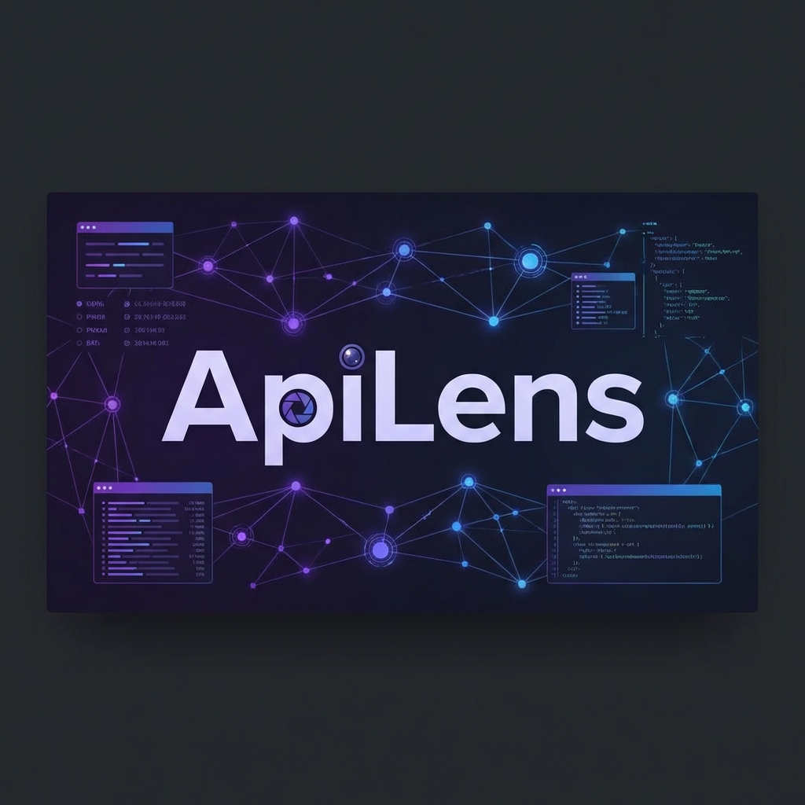

# ApiLens

  
   
  

 

ApiLens is a desktop/web-based API tool that connects REST, WebSocket, and GraphQL into a single workflow.

## Key Features
- **Multi-Client**: Support for REST / WebSocket / GraphQL Clients.
- **Workflow Editor**: Connect complex API scenarios with nodes and automate them.
- **Visual Debugging**: Real-time path highlighting (Green/Red) and active node pulsing.
- **Command Palette**: (Cmd+K) Fast access to all workflows, requests, and settings.
- **Workflow Templates**: Built-in library for common scenarios (Auth, CRUD, etc.).
- **Workgroup System**: Isolate and manage projects individually.
- **OpenAPI Import**: Filter by tags and selectively import endpoints.
- **Team Collaboration**: Share workgroups via Export/Import JSON.
- **Design**: Premium glassmorphism UI with smooth animations and dark mode.
- **Platform**: Supports Desktop (macOS, Windows, Linux), Mobile (Android, iOS/iPad), and Web.

## Quick Start
1. **Launch ApiLens**: Open the application.
2. **Create Workgroup**: Click the `+` button in the sidebar to create a new group.
3. **Import OpenAPI**: Right-click group -> `Import Swagger` to load specifications.
4. **Run Request**: Select a request from the list and click `Send`.
5. **Create Workflow**: Click `+ Workflow` to connect multiple requests.

---
Other languages: [한국어](README_KO.md) | [中文](README_CN.md)
