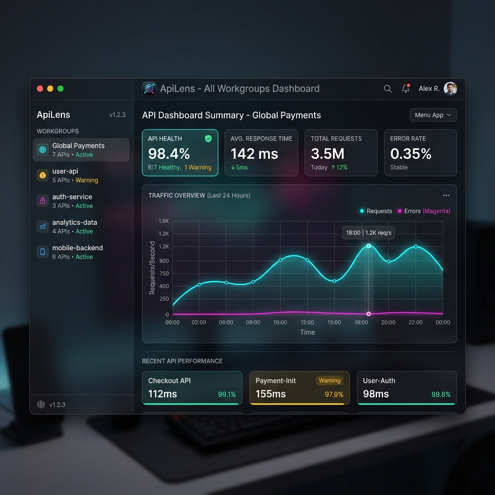
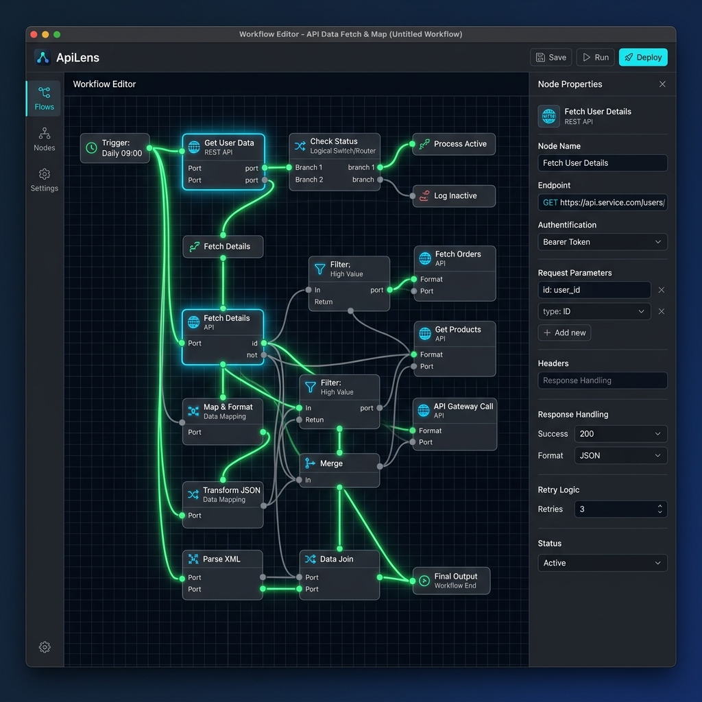
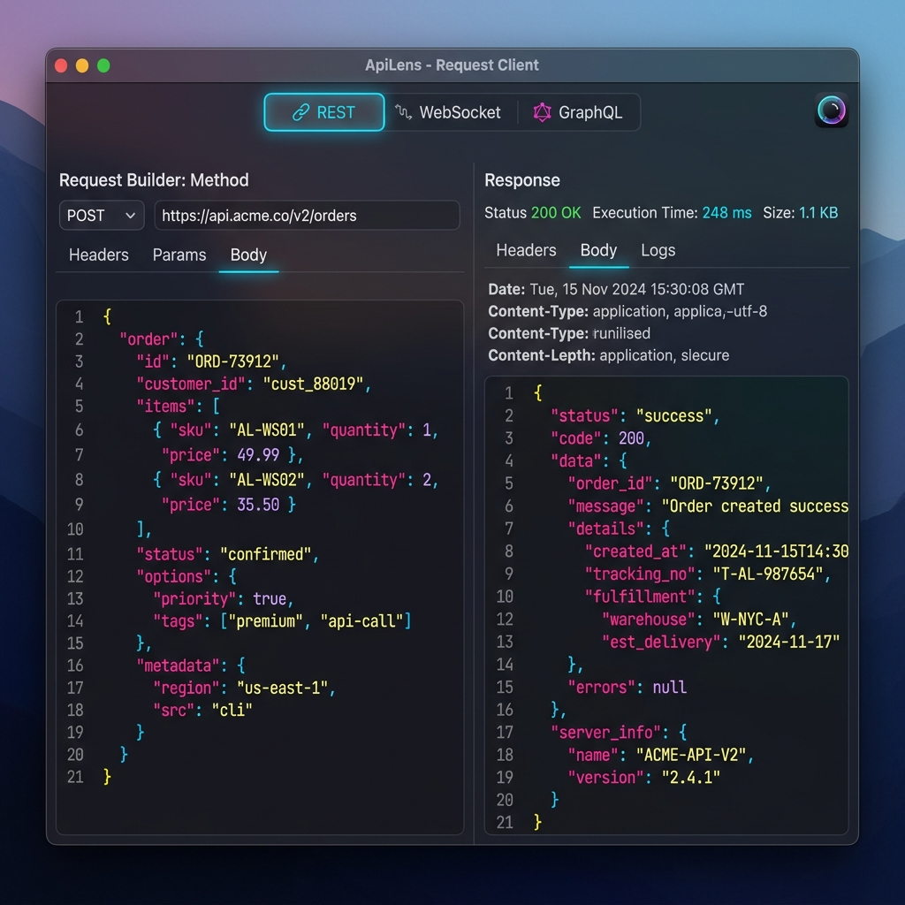

# 🎨 Apple App Store 자산 준비 완료

App Store 등록에 필요한 1024x1024 앱 아이콘과 고해상도 macOS 스크린샷 3종을 제작하여 프로젝트의 `assets` 디렉토리에 저장했습니다.

## 🍎 앱 아이콘 (1024x1024)

*경로: `assets/apilens_app_icon_1024.png`*

---

## 📸 스크린샷 (2560x1600)

### 1. 메인 대시보드 (Dashboard)

*경로: `assets/images/screenshot_dashboard.png`*
*설명: 전체 API 헬스체크와 트래픽 통계를 시각화한 프리미엄 대시보드입니다.*

### 2. 워크플로우 에디터 (Workflow Editor)

*경로: `assets/images/screenshot_workflow.png`*
*설명: 노드 기반의 복잡한 API 오케스트레이션과 실시간 디버깅 과정을 보여줍니다.*

### 3. 멀티 프로토콜 클라이언트 (Request Client)

*경로: `assets/images/screenshot_client.png`*
*설명: REST, WebSocket, GraphQL 요청 및 응답을 처리하는 전문적인 개발자 도구 인터페이스입니다.*

---

> [!NOTE]
> 모든 이미지는 프로젝트 내 `assets` 폴더에 복사되었으므로, App Store Connect에 업로드할 때 해당 파일들을 바로 사용하실 수 있습니다.
