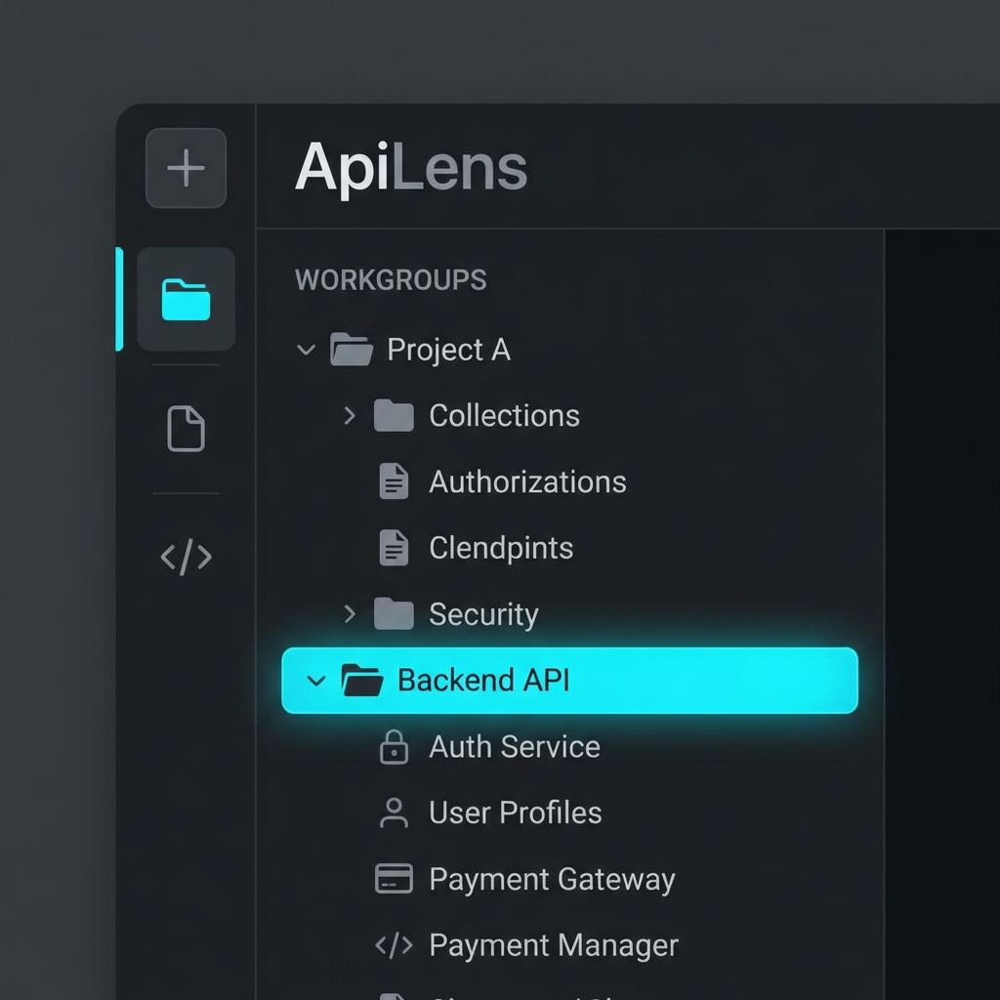
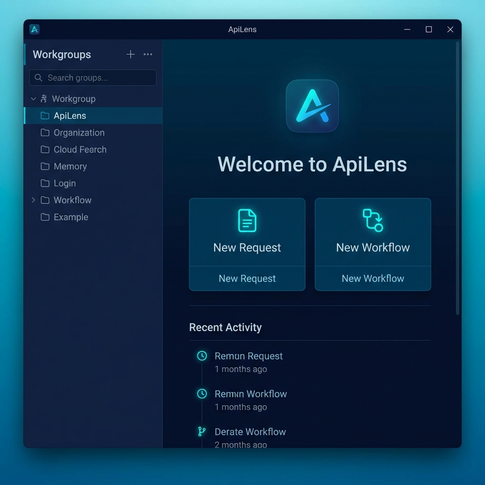

# ApiLens User Guide

<div align="center">
  
  <br/>
  
</div>

## 1. Overview
### What is ApiLens?
**ApiLens** is a powerful desktop and web-based tool that allows you to test REST APIs, WebSockets, and GraphQL in a single interface, and connect them into a **Workflow** to automate complex scenarios.

### Problems Solved
- **Fragmented Tools**: Solves the issue of managing REST (Postman), WebSocket (wscat), and automation scripts (Python) separately.
- **Collaboration Difficulties**: Easily share API specs and test scenarios via a single file (`.json`).
- **Complex Testing**: Configure sequential scenarios like "Receive token after login -> Connect WebSocket" without writing code.

### Target Audience
- **Backend/Frontend Developers** developing and testing APIs.
- **QA Engineers** requiring API scenario verification.
- **System Architects** dealing with multiple protocols (HTTP, WS, GQL).

---

## 2. Installation & Execution


### Desktop (macOS / Windows)
1. Download the installer (`.dmg`, `.exe`) for your OS from the Releases page.
2. Run the application after installation.
3. The local DB (Hive/Isar) initializes immediately without extra configuration.

### Web
1. Visit the hosted URL (e.g., `apilens.app`).
2. Data is stored using the browser's local storage (IndexedDB).
   > **Note**: Clearing browser cache may result in data loss, so export important data frequently.

### Connecting to Test Backend
You can run a backend server locally for ApiLens development and testing.
```bash
# Run backend server (Node/Python depending on project)
npm run start:server
```
Typically uses `http://localhost:3000` or `ws://localhost:8080`.

---

## 3. Core Concepts
### Request
The basic unit of API calls.
- **REST**: Supports HTTP methods like GET, POST, PUT, DELETE. Configurable Params, Headers, Body.
- **WebSocket**: Connect, Send Message, Wait for Message.
- **GraphQL**: Execute Query/Mutation and generic Variables support.

### Workflow
A flowchart connecting multiple Requests as Nodes.
- **Start Node**: execution entry point.
- **Request Node**: Performs REST/GQL requests.
- **WebSocket Node**: Handles connection and message I/O.
- **Delay/Script Node**: Waits or performs simple value transformations.

### Workgroup
A project-level folder concept. Isolates Requests and Workflows just like folders in a local file system.

### Environment
Manages global variables like `{{env.baseUrl}}` to easily switch between Development/Production environments. (Currently under development)

---

## 4. Using Workgroups


### Create/Select Workgroup
- **Create**: Click the `+` button at the top of the sidebar and enter a new group name.
- **Select**: Click a group in the sidebar to activate it; subsequent Requests will belong to this group.

### no-workgroup (System Group)
- Items created without selecting a group are saved in `System Default` or `No Workgroup`.
- Accessible at the top of the sidebar.

### Management & Move
- **Move**: Drag and drop Requests to move them to another Workgroup.
- **Delete**: Right-click a group to delete it. (Option to keep internal data is available).

### Export / Import (Team Sharing)


1. **Export**: Right-click a Workgroup and select `Export` to save as a `.json` file.
2. **Import**: Load `.json` files via the `Import` button (or menu) at the top of the sidebar.
   > **ID Conflict Prevention**: Automatically issues new IDs if imported data conflicts with existing IDs.

---

## 5. REST Request Builder


### Create New Request
1. Select `HTTP / REST` from the top tabs.
2. Choose Method (GET, POST, etc.) and enter URL.

### Detailed Settings
- **Params**: Enter Query Parameters as Key-Value pairs.
- **Headers**: Set headers like `Content-Type`, `Authorization`.
- **Body**: Select JSON, Text, Form Data, etc. JSON supports syntax highlighting.
- **Auth**: Easy configuration for Basic, Bearer Token, etc.

### Execution & Results
- Click `Send` to view response results (Status, Time, Size, Body) in the right (or bottom) panel.
- JSON responses are formatted in a Tree View for readability.

### Relation to Workgroup
Saving a request (`Ctrl+S` / `Cmd+S`) saves it to the currently active Workgroup.

---

## 6. WebSocket


### Using WebSocket Client
1. Select `WebSocket` from the top tabs.
2. Enter URL (e.g., `wss://echo.websocket.org`) and click `Connect`.
3. Green status indicator appears upon success.
4. Enter message and click `Send`.
5. Send/Receive logs are displayed in real-time.

### Use in Workflow
WebSockets are powerful in Workflows as state is maintained.
- **ws_connect Node**: Establishes connection and returns Session ID.
- **ws_send Node**: Sends message to a specific session.
- **ws_wait Node**: Waits until a specific message or pattern is received (for test verification).

---

## 7. GraphQL


### Using GraphQL Client
1. Select `GraphQL` from the top tabs.
2. Enter Endpoint URL.
3. Write Query/Mutation in the left editor.
4. Enter JSON variables in the bottom Variables tab if needed.
5. Click `Execute`.

### REST → GraphQL Integration
In a Workflow, obtain an auth token via REST API, then inject it into GraphQL Headers (`Authorization: Bearer {{token}}`).

---

## 8. Workflow Editor


### Add/Connect Nodes
1. Enter editor via top menu or `+ Workflow` button.
2. Drag nodes from the left palette to the canvas.
3. Drag node handles (dots) to connect to other nodes (create Edge).

### Execution


- Click the `Run` button at the top right.
- Running nodes blink, completing green for success or red for failure.
- Check execution results per step in the bottom Log Panel.

### Debugging Tips
- **Inspector**: Click a node to view detailed Input/Output data in the right panel.
- **Partial Run**: Disconnect or select specific nodes to run partial tests.

---

## 9. OpenAPI Import


### How to Import
1. Right-click Workgroup -> Select `Import Swagger`.
2. **Load URL**: Enter `swagger.json` URL and Load.
3. **Load File**: Select a local file.

### Filtering & Selection
- **Tag Filter**: Check only desired tags (e.g., `User`, `Order`) on the left.
- **Search**: Search by API Path or Summary in the top bar.
- **Selection**: Select validation APIs via checkboxes in the list.

### Import Options
- **Base URL**: Choose to use Server URL from spec or substitute with environment variable (`{{env.baseUrl}}`).
- **Auto-Generate Body**: Whether to automatically generate Request Body examples.
- **Auth**: Whether to automatically include security schemes (API Key, etc.) in headers.

---

## 10. Theme & Settings


### Dark / Light Switch
- Top right menu -> Enter `Settings`.
- Select Light / Dark / System in `Theme Mode`.

### Other Settings
- **Timeout**: Set request timeout duration (Default 30s).
- **Logging**: Enable/Disable debug logs.

---

## 11. Troubleshooting
### FAQ
**Q. CORS Error occurs during REST request.**
A. The Web version has CORS restrictions due to browser security policies. Use the Desktop app or allow CORS on the server.

**Q. Import Failed ("Invalid Format")**
A. Ensure compliance with OpenAPI 3.0/3.1 specs. If YAML, try converting to JSON.

**Q. Workgroup disappeared.**
A. Clearing browser cache resets data (Web). Periodically Export important data for backup.
