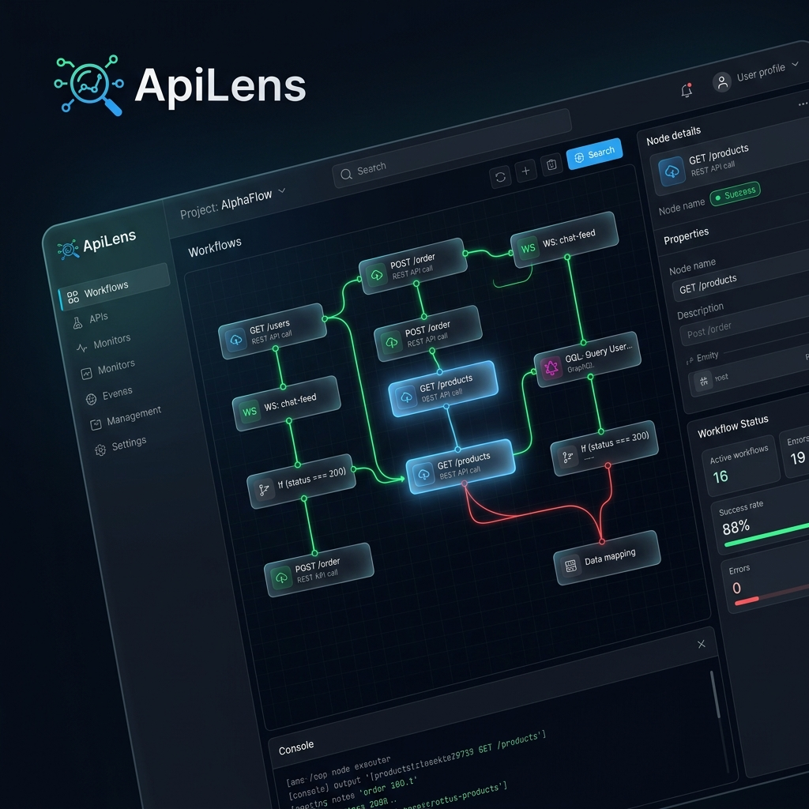

# 🚀 ApiLens: 描绘 API 编排的未来

## 🎨 超越连接：工作流的视觉艺术

现代 API 开发不仅仅是请求与响应。**ApiLens** 将碎片化的测试脚本和复杂的代码转化为直观的视觉画布。

### 🌟 为什么选择 ApiLens 工作流？

*   **无代码自动化**：无需编写复杂的 `bash` 或 `python` 脚本，只需连接节点即可构建强大的自动化场景。
*   **多协议和谐**：将 REST、WebSocket 和 GraphQL 无缝织入单一的工作流中。
*   **实时调试**: 实时观察数据流动。成功节点以 **绿色** 闪烁，失败则立即变为 **红色**。
*   **即时洞察**: 通过主仪表板实时监控 API 状态、响应时间和流量趋势。

---

### 🔍 实际应用场景：认证与数据同步
*   **第 1 步**：通过 `Auth API` 节点请求登录。
*   **第 2 步**：将收到的 `Token` 保存为全局变量。
*   **第 3 步**：使用 `Condition` 节点验证 Token 有效性。
*   **第 4 步**：若有效，则通过 `WebSocket` 节点建立实时数据流。

---

## 🛠 核心工作流功能

### 1️⃣ 基于节点的视觉编辑器
通过简单的拖拽连接 API 请求、逻辑判断和数据转换节点。体验极致的毛玻璃感 (Glassmorphism) 界面，让逻辑流程一目了然。

### 2️⃣ 实时视觉反馈
工作流运行时，活动节点将伴随 **蓝色光晕** 闪烁。即时发现瓶颈，精准定位逻辑失败的位置。

### 3️⃣ 智能数据映射
将前一个节点的响应值作为下一个节点的输入变得前所未有的简单。可视化浏览并映射 JSON 路径。

### 4️⃣ 高级主仪表板
不仅仅是一个工具，更是您系统的控制中心。通过实时流量图表和关键性能指标 (KPI) 一目了然地掌握 API 生态系统的健康状况。

---

## 🚀 开启工作流创新的 3 个步骤

1.  **导入**：导入 OpenAPI (Swagger) 规范，将端点转换为节点。
2.  **连接**：从头到尾定义执行顺序和触发条件。
3.  **运行**：点击 “运行”，见证您的系统以视觉化的方式焕发生机。

---

> "ApiLens 不仅仅是一个工具；它是拓展 API 开发者思维方式的新透镜。"

### 📥 立即开始
[下载 ApiLens v1.0.0](https://github.com/clevekim00/ApiLens/releases)

---

  
© 2026 ApiLens Team. Built with Flutter for Developers.

