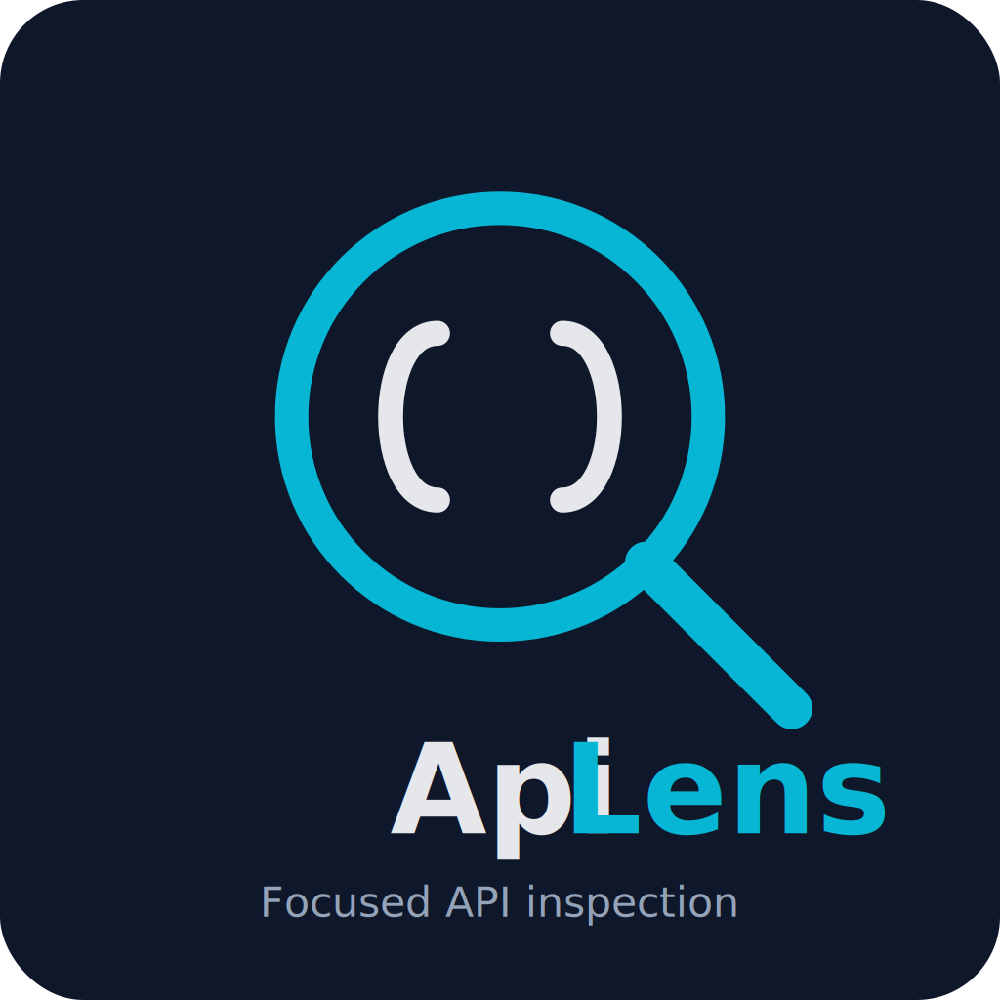
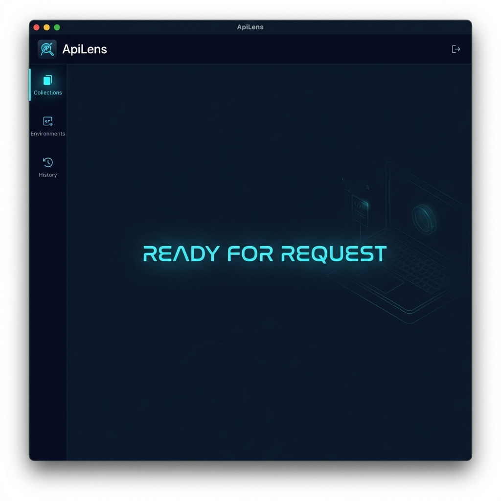

# ApiLens로 첫 요청 보내기

  

이 가이드는 ApiLens에서 첫 API 요청을 보내는 과정을 안내합니다.
5분이면 충분합니다.

---

## Step 1: ApiLens 실행
ApiLens를 실행하면 첫 요청을 기다리는 빈 작업 공간이 보입니다.

---

## Step 2: Workgroup 생성
프로젝트를 관리할 새 그룹을 만듭니다.
1. 사이드바에서 **New Workgroup**(`+`)을 클릭합니다.
2. 그룹 이름(예: `My First Project`)을 입력합니다.

<!--  -->

---

## Step 3: 새 요청 만들기 (Create a new request)
1. 상단의 **New Request** 버튼을 클릭합니다.
2. **HTTP / REST**를 선택합니다.

<!--  -->

---

## Step 4: 요청 정보 입력 (Enter the request details)
간단한 건강 상태 체크 API를 호출해 봅니다.
1. **Method**: `GET`으로 설정합니다.
2. **URL**: `https://api.apilens.dev/health`를 입력합니다.

<!--  -->

---

## Step 5: 요청 보내기 (Send the request)
준비가 되셨나요? **Send** 버튼을 클릭하세요.

<!--  -->

---

## Step 6: 응답 확인 (View the response)
하단 패널에서 결과를 확인합니다.
1. **Status Code**: `200 OK`가 보이는지 확인하세요.
2. **Body**: JSON 응답이 트리 형태로 표시됩니다.

<!--  -->

---

## Step 7: 요청 저장 (Save the request)
성공한 요청을 나중을 위해 저장합니다.
1. `Ctrl+S` (macOS: `Cmd+S`)를 누르거나 저장 아이콘을 클릭합니다.
2. 이름(예: `Health Check`)을 입력하고 방금 만든 Workgroup에 저장합니다.

<!--  -->

---

## What’s next?
축하합니다! 첫 번째 요청을 성공적으로 보냈습니다.
이제 다음 단계로 나아가 보세요:

- **OpenAPI Import**: 기존 API 명세를 한 번에 불러오기
- **Workflow**: 여러 요청을 연결하여 자동화하기
- **WebSocket / GraphQL**: 다양한 프로토콜 탐험하기

<!--  -->
