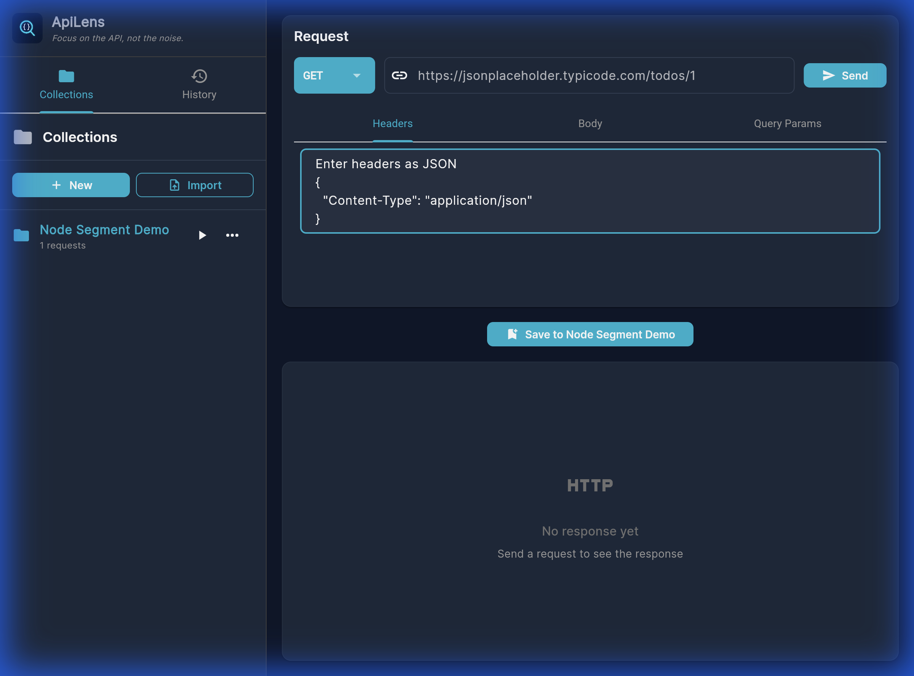
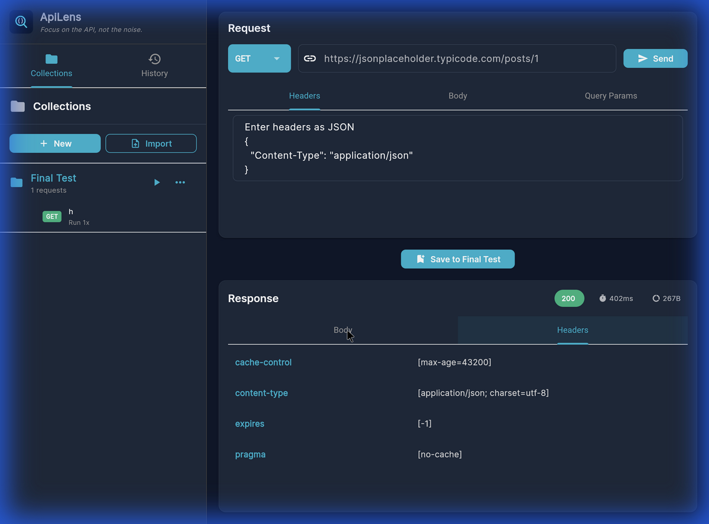
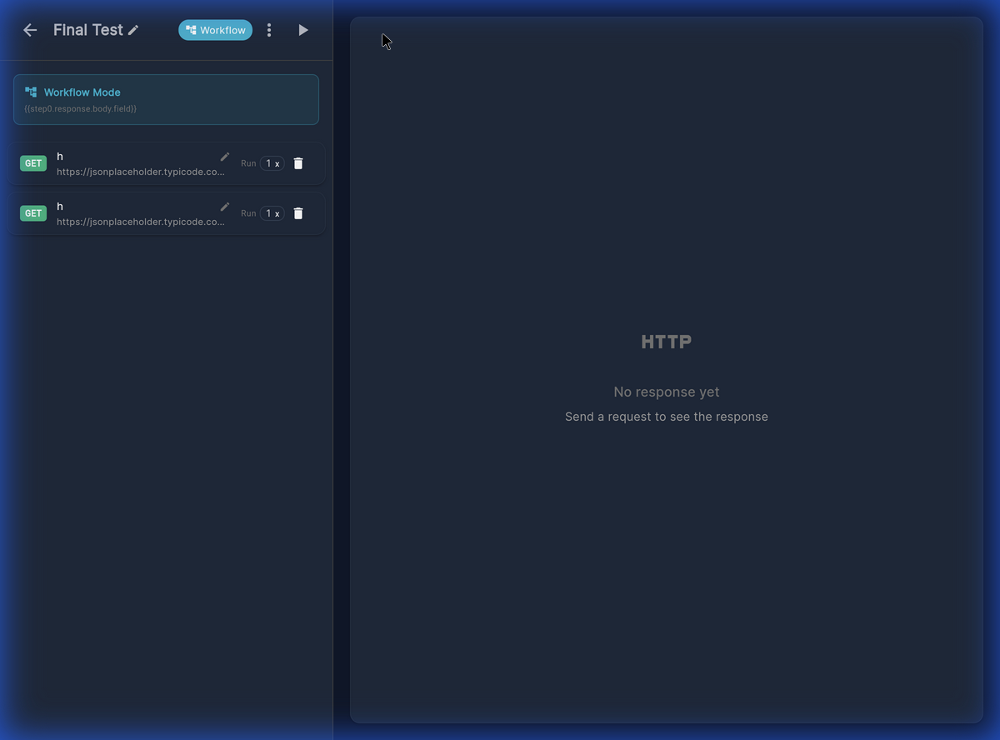

# ApiLens (👁️) - 사용자 가이드

**"API에 집중하고, 소음은 걷어내세요 (Focus on the API, not the noise)."**

ApiLens는 Flutter로 구축된 고성능 REST API 테스팅 도구입니다. 직관적인 UI, 강력한 워크플로우 자동화, 그리고 시각적으로 풍부한 응답 분석 기능을 제공합니다.

---

## 🎨 새로운 브랜딩: ApiLens
기존의 'API Tester'에서 **ApiLens**로 완전히 리브랜딩되었습니다.
- **프리미엄 다크 모드**: Deep Blue와 Cyan 컬러 팔레트를 사용하여 개발자의 눈이 편안한 환경을 제공합니다.
- **새로운 아이콘**: 현대적이고 전문가적인 감각의 새로운 앱 아이콘이 적용되었습니다.

---

## 🚀 핵심 기능

### 1. 컬렉션 관리 & 자동 저장
- **자동 동기화**: 모든 컬렉션과 요청 데이터는 실시간으로 로컬 저장소에 저장되며, 앱 실행 시 자동으로 로드됩니다. 별도의 임포트/익스포트 과정 없이도 작업 내역이 보존됩니다.
- **직관적인 편집**: 컬렉션 이름을 클릭하여 즉시 수정하거나, ✏️ 버튼을 통해 요청 이름을 빠르게 변경할 수 있습니다.

### 2. 비주얼 워크플로우 에디터 (Flow Editor)
단순한 리스트 기반의 실행을 넘어, 복잡한 API 시퀀스를 그래프 형식으로 설계할 수 있습니다.

- **인터랙티브 노드**: API 요청과 로직 노드(If/Else, Log)를 캔버스에 드래그하여 배치합니다.
- **결과 세그먼트**: 실행이 완료된 노드는 카드 하단에 'Header'와 'Body' 세그먼트가 나타나며, 이를 클릭하면 즉시 결과 팝업이 표시됩니다.
- **로직 분기**: 응답 상태 코드나 데이터에 따라 실행 흐름을 제어하는 If/Else 노드를 지원합니다.

*노드 실행 결과 세그먼트와 상세 팝업 탐색*

---

## 📊 전문적인 응답 분석

ApiLens는 응답 데이터를 더 깊이 있고 직관적으로 분석할 수 있는 최적의 도구를 제공합니다.

### 1. 인터랙티브 JSON 트리 뷰
`application/json` 타입의 응답은 자동으로 트리 구조로 렌더링됩니다. 거대한 JSON 데이터도 효율적으로 접고 펼치며 원하는 정보를 빠르게 찾을 수 있습니다.

### 2. 깔끔한 헤더 테이블
복잡한 HTTP 헤더 정보를 단순 텍스트가 아닌, 정렬된 키-값 테이블 형식으로 제공하여 가독성을 극대화했습니다.

### 3. 상태 메트릭 배지
HTTP 상태 코드, 응답 시간(ms), 콘텐츠 크기(B/KB)를 컬러 배지로 표시하여 요청의 건강 상태를 한눈에 파악할 수 있습니다.

*깔끔하게 정리된 헤더 테이블과 메트릭 정보*

---

## 🔗 배치 실행 및 결과 탭
리스트 모드에서 컬렉션 전체를 실행할 때, 각 요청의 결과를 개별적으로 분석할 수 있는 강력한 뷰를 제공합니다.

- **탭 방식 인터페이스**: 여러 요청이 실행되면 우측 패널에 각 요청별 탭이 생성됩니다.
- **독립적인 결과 보존**: 각 탭은 위에서 설명한 JSON 트리와 헤더 테이블 기능을 모두 포함하고 있어, 여러 요청의 결과를 실시간으로 스위칭하며 비교할 수 있습니다.

*컬렉션 배치 실행 후 탭별로 구분된 상세 결과*

---

## 📟 통합 콘솔 & 로그
워크플로우 실행 중 발생하는 모든 이벤트와 커스텀 로그를 하단 콘솔 창에서 실시간으로 확인할 수 있습니다.
- **변수 치환 지원**: `{{response.body.id}}`와 같은 패턴을 사용하여 동적인 데이터를 로그로 출력할 수 있습니다.

---

## 📦 빌드 및 실행
ApiLens는 macOS, Windows 및 웹 환경을 지원합니다.

- **macOS 빌드**: `flutter build macos --release`
- **웹 서빙**: `python3 -m http.server 8080 --directory build/web`

---

## ✅ 개발자 정보
- **GitHub**: [https://github.com/clevekim00/ApiLens](https://github.com/clevekim00/ApiLens)
- **Copyright**: © 2026 clevekim. MIT License.
