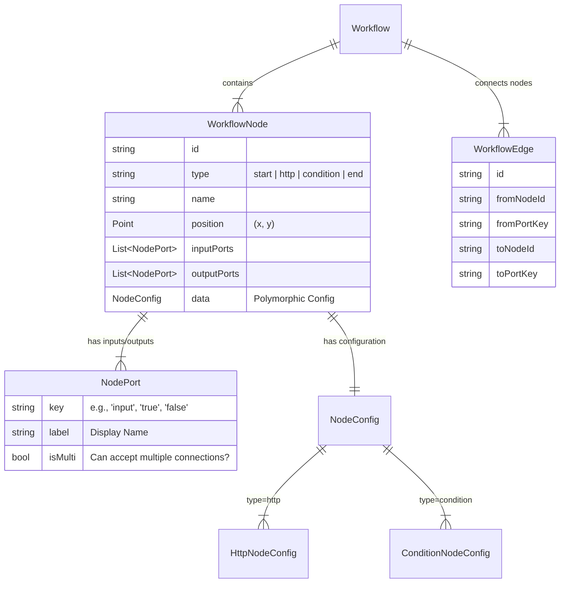

# ApiLens Workflow Data Model (Session 2)

## Entity Relationship Diagram


## JSON Structure Models

### 1. Port
```dart
class NodePort {
  final String key;
  final String label;
  // ... toJson/fromJson
}
```

### 2. Edge
```dart
class WorkflowEdge {
  final String id;
  final String fromNodeId;
  final String fromPortKey;
  final String toNodeId;
  final String toPortKey;
  // ... toJson/fromJson
}
```

### 3. Node & Configurations
**Common Interface**:
```dart
class WorkflowNode {
  final String id;
  final NodeType type;
  final String name;
  final Offset position;
  final List<NodePort> inputs;
  final List<NodePort> outputs;
  final BaseNodeConfig? data;
  // ...
}
```

**Configurations**:
- **HttpNodeConfig**: `method` (GET/POST...), `url`, `headers` (Map), `query` (Map), `body`, `auth`.
- **ConditionNodeConfig**: `expression` (String).

## Implementation Details
- **Polymorphism**: `NodeConfig` will be an abstract class or union, serialized with a `type` discriminator if needed, or handled within the parent `WorkflowNode` serialization logic based on the `type` field.
- **Hive Compatibility**: To maintain existing persistence, we will likely keep `@HiveType` annotations but create separate pure Dart classes or distinct "DTOs" if it gets too complex, OR just enhance the existing Hive classes with granular fields. *Decision: Refactor existing Hive classes to match new spec.*
