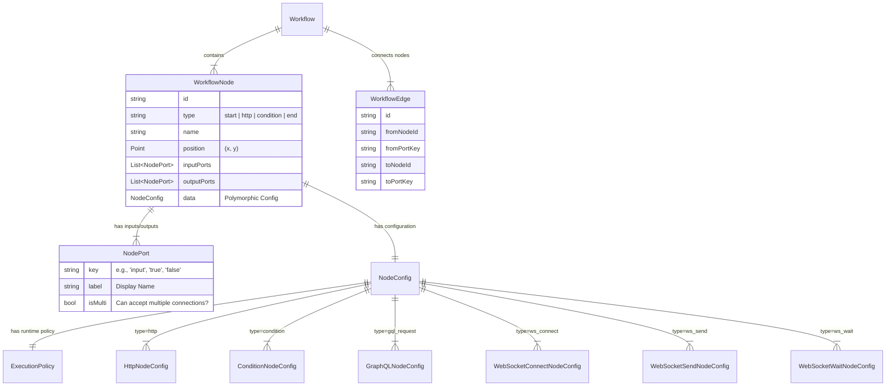

# ApiLens Workflow Data Model (Session 2)

## Entity Relationship Diagram

```mermaid
erDiagram
    Workflow ||--|{ WorkflowNode : contains
    Workflow ||--|{ WorkflowEdge : "connects nodes"
    WorkflowNode ||--|{ NodePort : "has inputs/outputs"
    WorkflowNode ||--|| NodeConfig : "has configuration"
    NodeConfig ||--|| ExecutionPolicy : "has runtime policy"
    
    WorkflowEdge {
        string id
        string fromNodeId
        string fromPortKey
        string toNodeId
        string toPortKey
    }

    WorkflowNode {
        string id
        string type "start | http | condition | end"
        string name
        Point position "(x, y)"
        List~NodePort~ inputPorts
        List~NodePort~ outputPorts
        NodeConfig data "Polymorphic Config"
    }

    NodePort {
        string key "e.g., 'input', 'true', 'false'"
        string label "Display Name"
        bool isMulti "Can accept multiple connections?"
    }

    NodeConfig ||--|{ HttpNodeConfig : "type=http"
    NodeConfig ||--|{ ConditionNodeConfig : "type=condition"
    NodeConfig ||--|{ GraphQLNodeConfig : "type=gql_request"
    NodeConfig ||--|{ WebSocketConnectNodeConfig : "type=ws_connect"
    NodeConfig ||--|{ WebSocketSendNodeConfig : "type=ws_send"
    NodeConfig ||--|{ WebSocketWaitNodeConfig : "type=ws_wait"
```

## JSON Structure Models

### 1. Port
```dart
class NodePort {
  final String key;
  final String label;
  // ... toJson/fromJson
}
```

### 2. Edge
```dart
class WorkflowEdge {
  final String id;
  final String fromNodeId;
  final String fromPortKey;
  final String toNodeId;
  final String toPortKey;
  // ... toJson/fromJson
}
```

### 3. Node & Configurations
**Common Interface**:
```dart
class WorkflowNode {
  final String id;
  final NodeType type;
  final String name;
  final Offset position;
  final List<NodePort> inputs;
  final List<NodePort> outputs;
  final BaseNodeConfig? data;
  // ...
}
```

**Configurations**:
- **HttpNodeConfig**: `method` (GET/POST...), `url`, `headers` (Map), `body`, optional `execution`.
- **ConditionNodeConfig**: `expression` (String), optional `execution`.
- **GraphQLNodeConfig**: `endpoint`, `headers`, `query`, `variablesJson`, `storeAs`, optional `execution`.
- **WebSocketConnectNodeConfig**: `mode`, `url`, `configRefId`, `storeAs`, `headers`, optional `execution`.
- **WebSocketSendNodeConfig**: `sessionKey`, `payloadFormat`, `payload`, optional `execution`.
- **WebSocketWaitNodeConfig**: `sessionKey`, `timeoutMs`, `match`, optional `execution`.

**Execution Policy**:
```dart
class ExecutionPolicy {
  final int? timeoutMs;
  final RetryPolicy retry;
}

class RetryPolicy {
  final int maxAttempts;
  final int backoffMs;
  final List<int> retryOnStatusCodes;
  final bool retryOnTimeout;
}
```

Runtime rules:
- `timeoutMs` is applied per attempt.
- `maxAttempts` is the number of retries after the first attempt.
- HTTP/GraphQL nodes can retry on configured status codes such as `408`, `429`, and `5xx`.
- WebSocket nodes can retry on exceptions and timeout.
- Exhausted retries route executable nodes to the `failure` port.

## Implementation Details
- **Polymorphism**: `NodeConfig` will be an abstract class or union, serialized with a `type` discriminator if needed, or handled within the parent `WorkflowNode` serialization logic based on the `type` field.
- **Hive Compatibility**: To maintain existing persistence, we will likely keep `@HiveType` annotations but create separate pure Dart classes or distinct "DTOs" if it gets too complex, OR just enhance the existing Hive classes with granular fields. *Decision: Refactor existing Hive classes to match new spec.*
