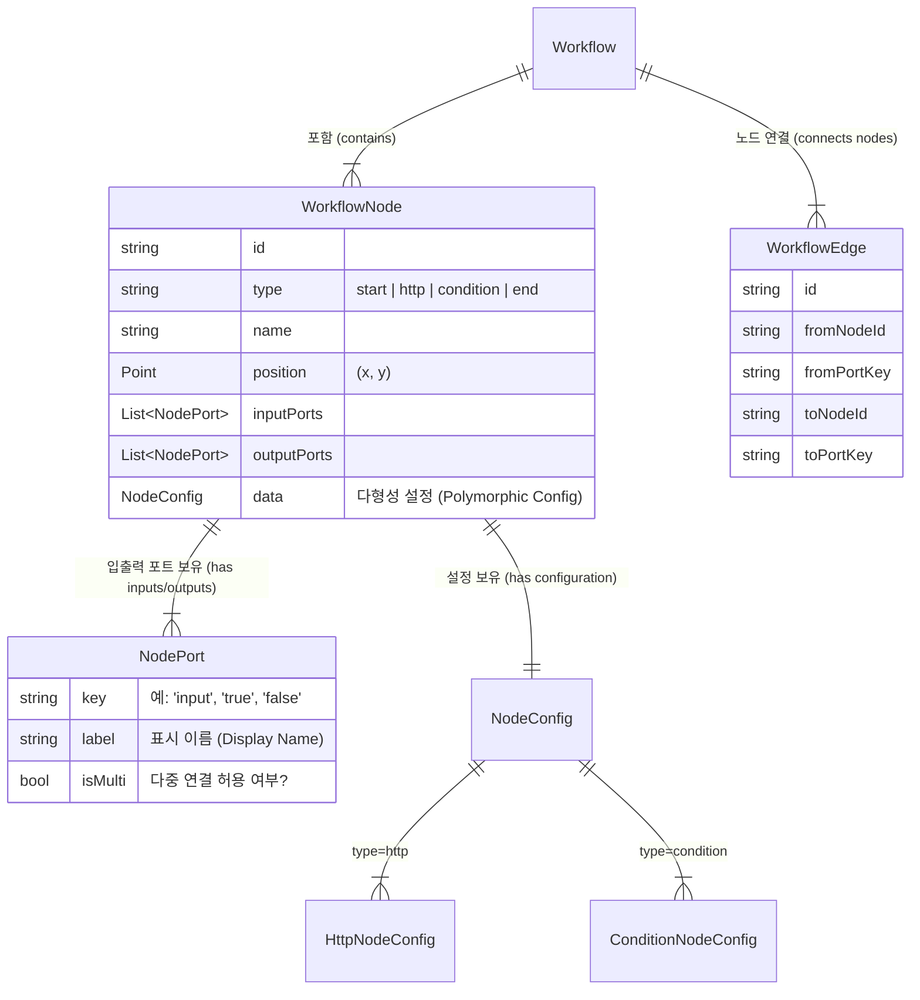

# ApiLens 워크플로우 데이터 모델 (세션 2)

## 개체 관계 다이어그램 (ERD)


## JSON 구조 모델

### 1. 포트 (Port)
```dart
class NodePort {
  final String key;
  final String label;
  // ... toJson/fromJson
}
```

### 2. 엣지 (Edge)
```dart
class WorkflowEdge {
  final String id;
  final String fromNodeId;
  final String fromPortKey;
  final String toNodeId;
  final String toPortKey;
  // ... toJson/fromJson
}
```

### 3. 노드 및 설정 (Node & Configurations)
**공통 인터페이스**:
```dart
class WorkflowNode {
  final String id;
  final NodeType type;
  final String name;
  final Offset position;
  final List<NodePort> inputs;
  final List<NodePort> outputs;
  final BaseNodeConfig? data;
  // ...
}
```

**설정 (Configurations)**:
- **HttpNodeConfig**: `method` (GET/POST...), `url`, `headers` (Map), `query` (Map), `body`, `auth`.
- **ConditionNodeConfig**: `expression` (String).

## 구현 세부사항
- **다형성 (Polymorphism)**: `NodeConfig`는 추상 클래스 또는 Union으로 구현되며, `type` 식별자를 통해 직렬화하거나 부모인 `WorkflowNode`의 직렬화 로직 내에서 `type` 필드를 기반으로 처리됩니다.
- **Hive 호환성**: 기존 영속성을 유지하기 위해 `@HiveType` 어노테이션을 유지할 가능성이 높으나, 복잡해질 경우 별도의 순수 Dart 클래스나 "DTO"를 생성하거나, 기존 Hive 클래스에 세부 필드를 추가하는 방식으로 확장할 것입니다. *결정: 새로운 명세에 맞춰 기존 Hive 클래스를 리팩토링함.*
