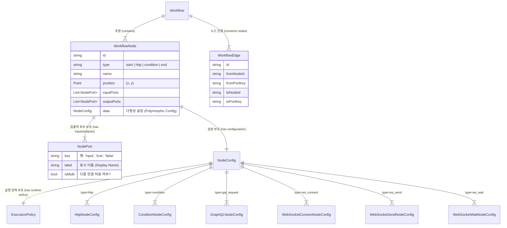

# ApiLens 워크플로우 데이터 모델 (세션 2)

## 개체 관계 다이어그램 (ERD)

```mermaid
erDiagram
    Workflow ||--|{ WorkflowNode : "포함 (contains)"
    Workflow ||--|{ WorkflowEdge : "노드 연결 (connects nodes)"
    WorkflowNode ||--|{ NodePort : "입출력 포트 보유 (has inputs/outputs)"
    WorkflowNode ||--|| NodeConfig : "설정 보유 (has configuration)"
    NodeConfig ||--|| ExecutionPolicy : "실행 정책 보유 (has runtime policy)"
    
    WorkflowEdge {
        string id
        string fromNodeId
        string fromPortKey
        string toNodeId
        string toPortKey
    }

    WorkflowNode {
        string id
        string type "start | http | condition | end"
        string name
        Point position "(x, y)"
        List~NodePort~ inputPorts
        List~NodePort~ outputPorts
        NodeConfig data "다형성 설정 (Polymorphic Config)"
    }

    NodePort {
        string key "예: 'input', 'true', 'false'"
        string label "표시 이름 (Display Name)"
        bool isMulti "다중 연결 허용 여부?"
    }

    NodeConfig ||--|{ HttpNodeConfig : "type=http"
    NodeConfig ||--|{ ConditionNodeConfig : "type=condition"
    NodeConfig ||--|{ GraphQLNodeConfig : "type=gql_request"
    NodeConfig ||--|{ WebSocketConnectNodeConfig : "type=ws_connect"
    NodeConfig ||--|{ WebSocketSendNodeConfig : "type=ws_send"
    NodeConfig ||--|{ WebSocketWaitNodeConfig : "type=ws_wait"
```

## JSON 구조 모델

### 1. 포트 (Port)
```dart
class NodePort {
  final String key;
  final String label;
  // ... toJson/fromJson
}
```

### 2. 엣지 (Edge)
```dart
class WorkflowEdge {
  final String id;
  final String fromNodeId;
  final String fromPortKey;
  final String toNodeId;
  final String toPortKey;
  // ... toJson/fromJson
}
```

### 3. 노드 및 설정 (Node & Configurations)
**공통 인터페이스**:
```dart
class WorkflowNode {
  final String id;
  final NodeType type;
  final String name;
  final Offset position;
  final List<NodePort> inputs;
  final List<NodePort> outputs;
  final BaseNodeConfig? data;
  // ...
}
```

**설정 (Configurations)**:
- **HttpNodeConfig**: `method` (GET/POST...), `url`, `headers` (Map), `body`, 선택적 `execution`.
- **ConditionNodeConfig**: `expression` (String), 선택적 `execution`.
- **GraphQLNodeConfig**: `endpoint`, `headers`, `query`, `variablesJson`, `storeAs`, 선택적 `execution`.
- **WebSocketConnectNodeConfig**: `mode`, `url`, `configRefId`, `storeAs`, `headers`, 선택적 `execution`.
- **WebSocketSendNodeConfig**: `sessionKey`, `payloadFormat`, `payload`, 선택적 `execution`.
- **WebSocketWaitNodeConfig**: `sessionKey`, `timeoutMs`, `match`, 선택적 `execution`.

**실행 정책 (Execution Policy)**:
```dart
class ExecutionPolicy {
  final int? timeoutMs;
  final RetryPolicy retry;
}

class RetryPolicy {
  final int maxAttempts;
  final int backoffMs;
  final List<int> retryOnStatusCodes;
  final bool retryOnTimeout;
}
```

실행 규칙:
- `timeoutMs`는 실행 시도 1회당 적용됩니다.
- `maxAttempts`는 최초 실행 이후 추가 재시도 횟수입니다.
- HTTP/GraphQL 노드는 `408`, `429`, `5xx` 계열 등 설정된 상태 코드에서 재시도할 수 있습니다.
- WebSocket 노드는 예외와 timeout 상황에서 재시도할 수 있습니다.
- 재시도를 모두 소진하면 실행형 노드는 `failure` 포트로 이동합니다.

## 구현 세부사항
- **다형성 (Polymorphism)**: `NodeConfig`는 추상 클래스 또는 Union으로 구현되며, `type` 식별자를 통해 직렬화하거나 부모인 `WorkflowNode`의 직렬화 로직 내에서 `type` 필드를 기반으로 처리됩니다.
- **Hive 호환성**: 기존 영속성을 유지하기 위해 `@HiveType` 어노테이션을 유지할 가능성이 높으나, 복잡해질 경우 별도의 순수 Dart 클래스나 "DTO"를 생성하거나, 기존 Hive 클래스에 세부 필드를 추가하는 방식으로 확장할 것입니다. *결정: 새로운 명세에 맞춰 기존 Hive 클래스를 리팩토링함.*
